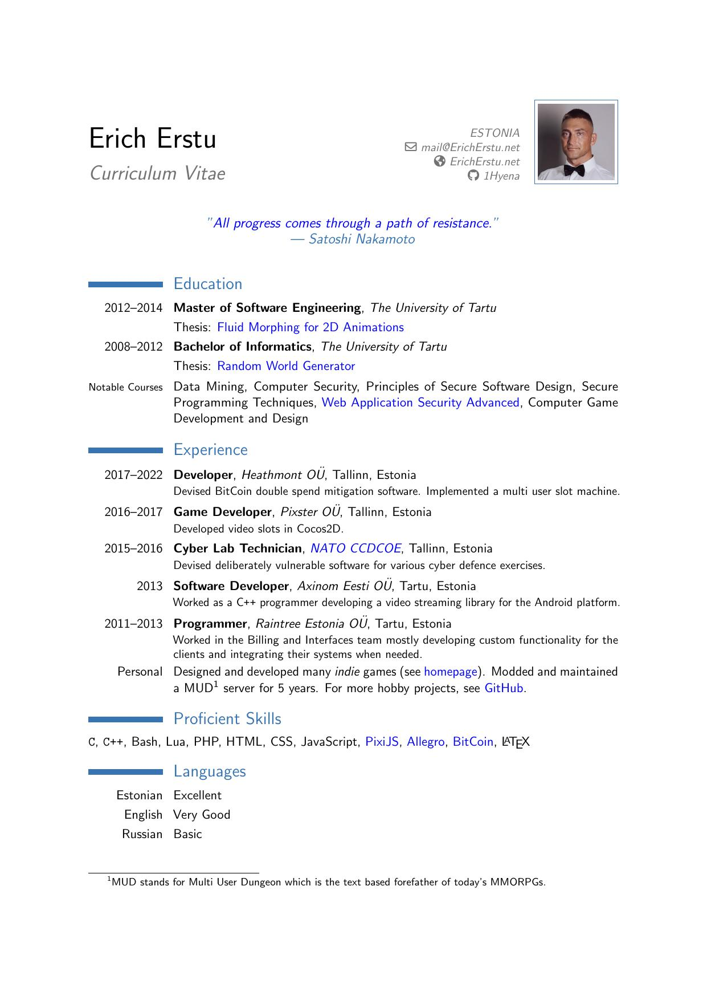
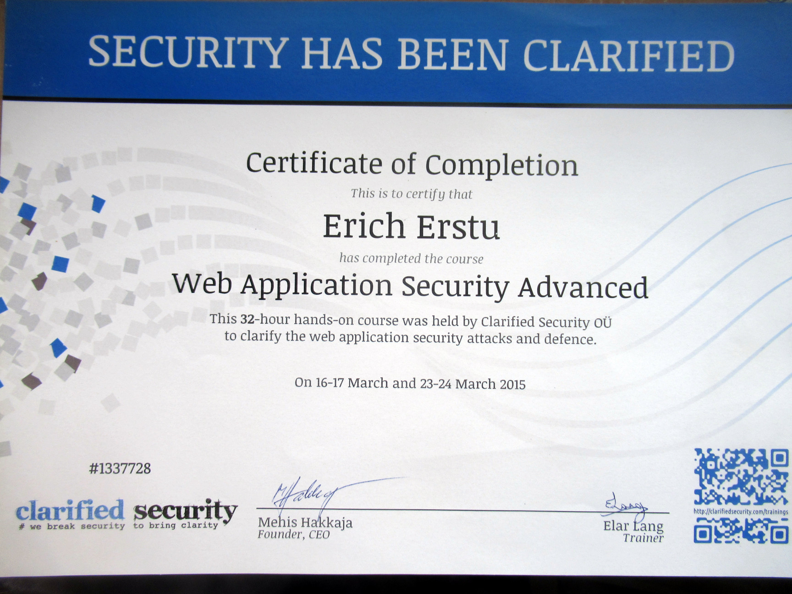
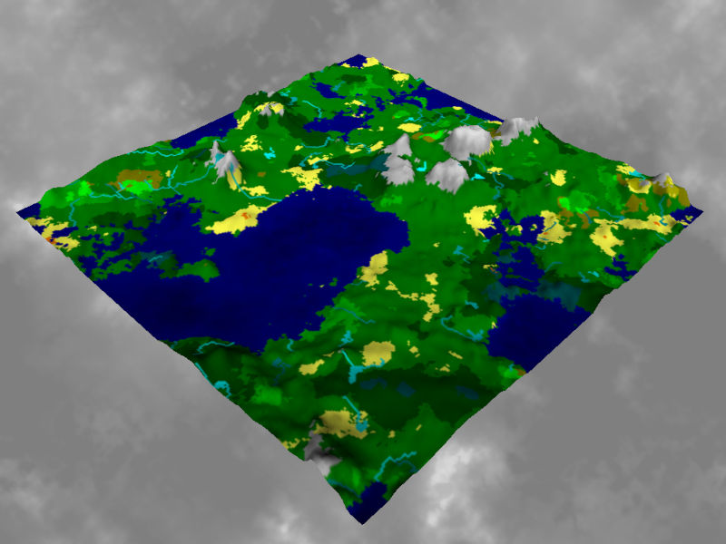

# Intro ########################################################################

|                                                                              |
| :--------------------------------------------------------------------------: |
|                                                                              |
|                |
|                                                                              |
|          _"In which lies the real question, that is the question."_          |
|                                                                              |
|            software engineer, game developer, researcher, investor           |

# About ########################################################################

This website serves as a formal publication of both the professional and social
information about the [living soul][ref-1] known as Erich Erstu.

|              |                         Contact Info                          |
| -----------: | :-----------------------------------------------------------: |
|      E-Mail: | mail@ |
|      Online: |    [LinkedIn][ref-9], [Facebook][ref-10], [GitHub][ref-11]    |

## Biography ###################################################################

|                     |                                                        |
| ------------------: | :----------------------------------------------------: |
|                     |            ![Photo of Erich Erstu][img-bio]            |
|                     |        Photo of **Erich Erstu**, September 2022        |
| Date·of·Live·Birth: |           15th of February, 1989 Anno Domini           |
|          Ethnicity: |                        Estonian                        |

[img-bio]: ./files/biography.jpg "Photo of Erich Erstu"

In his professional life Erich Erstu is a software engineer and a computer game
developer who often challenges the mundane world of dogmas with his novel
approaches and unconventional thinking. Although he has spent a fair share of
his working hours devising [BitCoin][ref-2] and online gambling related
projects, his favourite software engineering challenge is the creation of a
horizontally scalable game server for a massively multiplayer online role
playing game.

He wrote his first computer program at the age of five in QBasic. At the age of
12 he developed his first video game using the _GameMaker_ software. He learned
the C programming language on his own while modding a multi user dungeon (MUD)
server. At the age of 16 he started learning C++ which also became his favourite
programming language. Although he used the Windows operating system up until the
year 2012, he switched to Linux due to security concerns when buying his first
BitCoin.

Over the course of his life Erich has created dozens of video games and a
multitude of software projects, albeit none of these endeavours has brought him
any long-lasting fame or fortune. His ability to see the future and to make good
speculative investments on the other hand has abundantly compensated him the
time he has spent on developing software. That said, he does not necessarily see
any of his discontinued projects as a failure.

In his private life Erich enjoys lifting weights in the gym as a hobbyist
bodybuilder and often times innovation strikes him exactly there when he is
taking a resting break between sets. When at home he spends much of his computer
time on research of various (mostly controversial) topics. He is convinced that
in order to gain a competitive advantage in front of his fellow man he must
discard the mainstream beliefs and hold a mindset that the majority of "well
educated" people are wrong about virtually everything.

Being experienced in so many different arts and sciences Erich considers himself
more of a multidisciplinary problem solver than a mere software engineer. While
programming has indeed been his primary task he has also been in the role of a
game designer, software architect, software tester, computer hacker, conscript,
truck driver, warehouse manager, investor, day trader, BitCoin miner, artist,
creative director, composer, lyricist, drummer, shaman, nutritional advisor,
fitness coach, holistic doctor, parasitologist, alchemist, evangelist, exorcist,
carpenter and a plaintiff, to name a few.

## Curriculum Vitae ############################################################

|                                  |
| :--------------------------------------------------------------------------: |
|                  Click [here][ref-4] to open the CV in PDF.                  |

## Academic Degrees ############################################################

|                                       |                                      |
| :-----------------------------------: | :----------------------------------: |
|     ![Image of Diploma][img-msc]      |     ![Image of Diploma][img-bsc]     |
|          M.Sc in Engineering          |         B.Sc in Engineering          |
|       University of Tartu, 2014       |      University of Tartu, 2012       |
|            [THESIS][ref-7]            |            [THESIS][ref-8]           |

[img-msc]: ./files/diploma-msc.jpg "Master's Diploma"
[img-bsc]: ./files/diploma-bsc.jpg "Bachelor's Diploma"

## Professional Certifications #################################################

  * [Web Application Security Advanced][ref-3]

  

# Portfolio ####################################################################

As this website concentrates on the software engineering aspect of Erich Erstu's
doings, in the following sections some of his video games and other software
projects are listed and briefly described.

## Games #######################################################################

Over the course of his life Erich Erstu has authored many computer games. While
the full list is not fit for public scrutiny some of the more notable titles are
listed below.

### Slice&Dice Dungeon #########################################################

_Slice&Dice Dungeon_ (SnDD) is a multi user slot machine, backwards compatible
to Telnet. It is inspired by [MUDs][ref-0] and it incorporates aspects from
typical role-playing games. In addition to the Text User Interface, S&DD comes
with a browser based client written in HTML5 and Javascript. The latter is
responsible for making this game much more convenient for the vast majority of
the target audience as the client aims to resemble a slot machine.

|                  |                                                           |
| ---------------: | :-------------------------------------------------------: |
|                  | [![Screenshot][img-sndd]][vid-sndd]                       |
|           Title: | Slice&Dice Dungeon                                        |
|   Time·of·Focus: | 2017 — 2022                                               |
| Target·Platform: | Web browser                                               |
|      Tech·Stack: | C++, JavaScript, PixiJS                                   |
|          Status: | Discontinued                                              |

[img-sndd]: https://img.youtube.com/vi/vvHjwy3Z0i0/sd1.jpg
[vid-sndd]: https://www.youtube.com/watch?v=vvHjwy3Z0i0
            "Screen recording showing off Slice&Dice Dungeon"

### Sohni ######################################################################

_Sohni: Second Visit to the Underworld_, based on a chapter of the Estonian
national epic "Kalevipoeg", uses traditional adventure gaming elements to offer
a simplified yet still engaging artistic experience. The player guides the
protagonist Sohni through gloomy forests, murky bogs and eerie caves, where
every obstacle and decision might sway his will to push onward.

|                  |                                                           |
| ---------------: | :-------------------------------------------------------: |
|                  | [![Screenshot][img-sohni]][vid-sohni]                     |
|           Title: | Sohni — Second Visit to the Underworld                    |
|   Time·of·Focus: | 2012                                                      |
| Target·Platform: | Windows XP                                                |
|      Tech·Stack: | C++, Lua, Allegro5                                        |
|          Status: | Completed                                                 |
|                  | [DOWNLOAD](https://ericherstu.net/sohni/sohni.zip)        |

[img-sohni]: https://img.youtube.com/vi/eqws-L20gwE/sd3.jpg
[vid-sohni]: https://www.youtube.com/watch?v=eqws-L20gwE
             "Screen recording from the Sohni game"

### CatFight ###################################################################

_CatFight_ is a brutal cat fighting game. The basics are similar to _Mortal
Kombat_ except that there are street cats fighting instead of ninjas. Single
player consists of 10 levels. Two player mode is available.

|                  |                                                           |
| ---------------: | :-------------------------------------------------------: |
|                  | [![Screenshot][img-catfight]][vid-catfight]               |
|           Title: | CatFight                                                  |
|   Time·of·Focus: | 2007                                                      |
| Target·Platform: | Windows XP                                                |
|      Tech·Stack: | C++, Allegro4                                             |
|          Status: | Completed                                                 |
|                  | [DOWNLOAD](https://ericherstu.net/files/catfight.zip)     |

[img-catfight]: https://img.youtube.com/vi/wTVnKNLISds/sddefault.jpg
[vid-catfight]: https://www.youtube.com/watch?v=wTVnKNLISds
                "Screen recording from the CatFight game"

### Baltic Sea #################################################################

_Baltic Sea_ is a single player real time strategy game where the player has to
keep order on the Baltic Sea. The game was created with Gamemaker 5.3a in the
year 2007. This game was mainly developed by Erich Erstu, graphics were drawn by
Ivo Visak and background research was conducted by Allan Trukits.

|                  |                                                           |
| ---------------: | :-------------------------------------------------------: |
|                  | [![Screenshot][img-balticsea]][vid-balticsea]             |
|           Title: | Baltic Sea                                                |
|   Time·of·Focus: | 2007                                                      |
| Target·Platform: | Windows XP                                                |
|      Tech·Stack: | GameMaker 5.3a                                            |
|          Status: | Completed                                                 |
|                  | [DOWNLOAD](https://ericherstu.net/files/balticsea.zip)    |

[img-balticsea]: https://img.youtube.com/vi/J9s1lmNgtpw/sddefault.jpg
[vid-balticsea]: https://www.youtube.com/watch?v=J9s1lmNgtpw
                 "Screen recording from the Baltic Sea game"

### Arion MUD ##################################################################

_Arion_ is a text-based role-playing game and a multi user dungeon (MUD) based
on the Rivers of MUD engine. Erich modded and maintained it for fun and to teach
himself the C programming language.

|                  |                                                           |
| ---------------: | :-------------------------------------------------------: |
|                  | [![Screenshot][img-arion]][vid-arion]                     |
|           Title: | Arion MUD                                                 |
|   Time·of·Focus: | 2005 — 2015                                               |
| Target·Platform: | Telnet                                                    |
|      Tech·Stack: | C                                                         |
|          Status: | Discontinued                                              |

[img-arion]: https://img.youtube.com/vi/dJz3TqhI3Zw/sd3.jpg
[vid-arion]: https://www.youtube.com/watch?v=dJz3TqhI3Zw
             "Screen recording from the Arion MUD"

### RedEgg Adventures ##########################################################

This game is an arbitrary side-scrolling role-playing game where the player
takes the role of an abstract character named RedEgg who looks like he came out
of _Pac-Man_. Killing everyone who comes at him he slices and dices his way
through a fictional world that seems to be progressively turning into excrement.

|                  |                                                           |
| ---------------: | :-------------------------------------------------------: |
|                  | [![Screenshot][img-redegg]][vid-redegg]                   |
|           Title: | RedEgg Adventures                                         |
|   Time·of·Focus: | 2001 — 2005                                               |
| Target·Platform: | Windows XP                                                |
|      Tech·Stack: | GameMaker 5                                               |
|          Status: | Discontinued                                              |

[img-redegg]: https://img.youtube.com/vi/o0SgOOF2ow8/sd1.jpg
[vid-redegg]: https://www.youtube.com/watch?v=o0SgOOF2ow8
              "Screen recording from the RedEgg Adventures game"

### Troll ######################################################################

_Troll_ is a platform adventure game developed in the spirit of _Prehistorik 2_.
In this game the player is a troll named Thog who embarks on a quest to warn the
king about the sudden madness that has occurred in the animal kingdom.

|                  |                                                           |
| ---------------: | :-------------------------------------------------------: |
|                  | [![Screenshot][img-troll]][vid-troll]                     |
|           Title: | Troll                                                     |
|   Time·of·Focus: | 2004                                                      |
| Target·Platform: | Windows XP                                                |
|      Tech·Stack: | GameMaker 5                                               |
|          Status: | Completed                                                 |
|                  | [DOWNLOAD](https://ericherstu.net/files/troll.zip)        |

[img-troll]: https://img.youtube.com/vi/ivLlAgbir4k/sd3.jpg
[vid-troll]: https://www.youtube.com/watch?v=ivLlAgbir4k
             "Screen recording from the Troll game"

### Marko ######################################################################

_Marko_ is a simple adventure game named after its protagonist Marko who has to
raise money for a cool motorbike. The events of this game take place in the
parish of Kambja, Estonia. It was made in 2003 with Gamemaker 5.0. The game is
in Estonian.

|                  |                                                           |
| ---------------: | :-------------------------------------------------------: |
|                  | [![Screenshot][img-marko]][vid-marko]                     |
|           Title: | Marko                                                     |
|   Time·of·Focus: | 2003                                                      |
| Target·Platform: | Windows XP                                                |
|      Tech·Stack: | GameMaker 4.3                                             |
|          Status: | Completed                                                 |
|                  | [DOWNLOAD](https://ericherstu.net/files/marko.zip)        |

[img-marko]: https://img.youtube.com/vi/z24NQPOiUe0/sddefault.jpg
[vid-marko]: https://www.youtube.com/watch?v=z24NQPOiUe0
             "Screen recording from the Marko game"

## Software ####################################################################

While a more extensive list of software authored by Erich is available under his
[GitHub account][ref-5], some of the more noteworthy titles are also listed in
the following sections.

### Markdown Assembler #########################################################

MarkDown Monolith Assembler is a command line tool designed for building elegant
browser-based books using the Markdown markup language. When given a markdown
document as an input, this program produces a monolithic JavaScript-free HTML5
application as an output. For example, this very website has been generated with
MarkDown Monolith Assembler.

|                  |                                                           |
| ---------------: | :-------------------------------------------------------: |
|           Title: | MarkDown Monolith Assembler                               |
|   Time·of·Focus: | 2023                                                      |
|      Tech·Stack: | C++, HTML, CSS                                            |
|          Status: | Completed                                                 |
|                  | [SOURCE CODE](https://github.com/1Hyena/mdma)             |

### Sockets ####################################################################

Sockets is a single-threaded and signal-compatible header-only C++ library for
the creation and acceptance of TCP connections. The library makes use of the
*epoll* Linux kernel system call to implement a scalable I/O event notification
mechanism.

This library started out from the [Arion MUD](#Arion-MUD) server in 2012 and has
been revised and rewritten several times ever since. It was intended to be used
as a networking module for a MUD but is also used by other software such as
[TCP Coupler](#TCP-Coupler) and [TCP Nipple](#TCP-Nipple).

|                  |                                                           |
| ---------------: | :-------------------------------------------------------: |
|           Title: | Sockets                                                   |
|   Time·of·Focus: | 2012 — 2023                                               |
|      Tech·Stack: | C++                                                       |
|          Status: | Completed                                                 |
|                  | [SOURCE CODE](https://github.com/1Hyena/sockets)          |

### TCP Nipple #################################################################

This Linux program is a network client that joins together pairs of **outgoing**
TCP connections. It connects simultaneously to two hosts (_supply_ and _demand_)
and exchanges data between them.

With this tool it is trivial to host any TCP server locally rather than on a
_cloud_ or on a third party commercial server. This may turn useful if a hosting
provider charges based on CPU usage because then the computation heavy part of
the service could be executed on concealed and privately owned hardware. Please
refer to [TCP Coupler](#TCP-Coupler) to get an idea of how to set up such a
server.

|                  |                                                           |
| ---------------: | :-------------------------------------------------------: |
|           Title: | TCP Nipple                                                |
|   Time·of·Focus: | 2021 — 2023                                               |
|      Tech·Stack: | C++                                                       |
|          Status: | Completed                                                 |
|                  | [SOURCE CODE](https://github.com/1Hyena/tcpnipple)        |

### TCP Coupler ################################################################

This Linux program is a network server that joins together pairs of **incoming**
TCP connections. It listens simultaneously on two ports (_supply_ and _demand_)
and connects any new client on the _demand_ port with a client waiting on the
_supply_ port.

An example use case would be running this program as a public server in order to
provide access to a private server which cannot accept new connections by itself
but can connect to the public server when needed. See [TCP Nipple](#TCP-Nipple)
for a good example of such a private server.

|                  |                                                           |
| ---------------: | :-------------------------------------------------------: |
|           Title: | TCP Coupler                                               |
|   Time·of·Focus: | 2021 — 2023                                               |
|      Tech·Stack: | C++                                                       |
|          Status: | Completed                                                 |
|                  | [SOURCE CODE](https://github.com/1Hyena/tcpcoupler)       |

### CryptoGraffiti #############################################################

Bitcoin's block chain is a decentralized database which main purpose is to
secure and hold all Bitcoin transactions. It can be used to store other data
too. For example, lovers might want to "scratch" their name letters into the
block chain where they will remain forever. CryptoGraffiti allows people to read
and write such block chain messages.

Unfortunately, the project had to be discontinued because its continuation would
have required renting a datacenter. The potential revenue that such a peculiar
service would have generated simply did not balance out the costs associated
with a datacenter.

|                  |                                                           |
| ---------------: | :-------------------------------------------------------: |
|                  | [![Screenshot][img-cg]][vid-cg]                           |
|           Title: | CryptoGraffiti                                            |
|   Time·of·Focus: | 2014 — 2021                                               |
|      Tech·Stack: | JavaScript, HTML, CSS, PHP, MySQL, Bash, C++, BitCoin     |
|          Status: | Discontinued                                              |
|                  | [SOURCE CODE](https://github.com/1Hyena/cryptograffiti)   |

[img-cg]: https://img.youtube.com/vi/G4q8n8zWTOU/hq720.jpg
[vid-cg]: https://www.youtube.com/watch?v=G4q8n8zWTOU
          "Erich Erstu's CryptoGraffiti presentation during CoinGeek Week 2018"

# Research #####################################################################

From time to time Erich has ran into non-trivial problems that he needed to have
a solution for. In these circumstances the process of working out a solution has
required enough effort to be qualified as research. In this section some of the
more noteworthy research results are presented.

## Wave Function Collapse ######################################################

[Wave Function Collapse][ref-6] is a method devised for procedural generation of
images based on a sample image. The produced images are locally similar to the
input image which makes this method highly convenient for pattern generation.

Unlike the original method, Erich Erstu's method operates on an unbounded area.
Also, his method tolerates contradictions. This variant of the Wave Function
Collapse method was initially implemented to generate random dungeon maps for an
online role-playing game.

|                  |                                                           |
| ---------------: | :-------------------------------------------------------: |
|                  | [![Screenshot][img-wfc]][vid-wfc]                         |
|           Title: | Random Dungeons with the Wave Function Collapse Method    |
|   Time·of·Focus: | 2021                                                      |
|      Tech·Stack: | C++                                                       |
|          Status: | Completed                                                 |

[img-wfc]: https://img.youtube.com/vi/ue2adHLUU5k/sddefault.jpg
[vid-wfc]: https://www.youtube.com/watch?v=ue2adHLUU5k
           "Screen recording from the Wave Function Collapse demo"

## Fluid Morphing for 2D Animations ############################################

This study investigated the possibilities for image morphing that could be
applied to animations used in computer games. The motivation was to take
advantage of fluid dynamics in hope of achieving more natural looking
interpolations.

As a result of this research, a C++ library named AtoMorph was implemented. The
library is accompanied by an explanatory [thesis][ref-7] and it also earned
Erich a Master's Degree in Software Engineering.

|              |                                                               |
| -----------: | :-----------------------------------------------------------: |
|              | [![Screenshot][img-atomorph]][vid-atomorph]                   |
|        Title:| Fluid Morphing for 2D Animations                              |
|Time·of·Focus:| 2013 — 2014                                                   |
|   Tech·Stack:| C++                                                           |
|       Status:| Completed                                                     |
|              | [SOURCE CODE](https://github.com/1Hyena/atomorph)             |

[img-atomorph]: https://img.youtube.com/vi/TqFiMyXwFIU/sddefault.jpg
[vid-atomorph]: https://www.youtube.com/watch?v=TqFiMyXwFIU
                "Screen recording of the AtoMorph library in action"

## Random World Generator ######################################################

The aim of this work was to find an easy to use solution to a common problem —
generating random world maps that could be used in computer games. As a
constraint the desirable maps were meant to be of an Earth type planet including
its heightmap, bodies of water and biomes.

Using Perlin noise, water droplet simulation and Whittaker’s biome diagram a C++
library named RWG was implemented. The library is accompanied by a humble
[thesis][ref-8] written in Estonian as it also earned Erich a Bachelor's Degree
in Informatics.

|                  |                                                           |
| ---------------: | :-------------------------------------------------------: |
|                  |    |
|           Title: | Random World Generator                                    |
|   Time·of·Focus: | 2012                                                      |
|      Tech·Stack: | C++                                                       |
|          Status: | Completed                                                 |
|                  | [SOURCE CODE](https://github.com/1Hyena/rwg)              |

# Links ########################################################################

As in the good old times when people first started making personal websites for
themselves, the tail of this site is composed of a list of domains that we wish
to share with the world wide web.

## People ######################################################################

* [CraigWright.net](https://craigwright.net/) —
  professional website of the Creator of Bitcoin

## Software ####################################################################

* [ElectrumSV.io](https://electrumsv.io/) —
  deterministic Bitcoin wallet for desktop
* [Simply.cash](https://simply.cash/) —
  simple Bitcoin wallet for a smartphone

## News ########################################################################

* [CoinGeek.com](https://coingeek.com/) —
  trustworthy source of Bitcoin news

## Community ###################################################################

* [MetaNet.icu](https://metanet.icu/) —
  exclusive membership club focused on Bitcoin

[ref-0 ]: https://en.wikipedia.org/wiki/Multi-user_dungeon
         "Wikipedia article about Multi User Dungeons"
[ref-1 ]: https://www.biblegateway.com/passage/?search=Genesis+2%3A7&version=KJV
         "Reference to Genesis 2:7"
[ref-2 ]: https://papers.ssrn.com/sol3/papers.cfm?abstract_id=3440802
         "BitCoin Whitepaper by Craig Wright"
[ref-3 ]: http://www.clarifiedsecurity.com/web-application-security-training/
[ref-4 ]: ../cv/cv.pdf
         "Curriculum Vitae of Erich Erstu in PDF"
[ref-5 ]: https://github.com/1Hyena
         "GitHub account of Erich Erstu"
[ref-6 ]: https://github.com/mxgmn/WaveFunctionCollapse
         "GitHub page of the WaveFunctionCollapse project"
[ref-7 ]: https://hdl.handle.net/10062/56022 "Master's Thesis"
[ref-8 ]: https://hdl.handle.net/10062/32808 "Bachelor's Thesis"
[ref-9 ]: https://www.linkedin.com/in/erich-erstu-72a6a171/ "LinkedIn Profile"
[ref-10]: https://www.facebook.com/erich.erstu "Facebook Profile"
[ref-11]: https://github.com/1Hyena "GitHub Profile"
