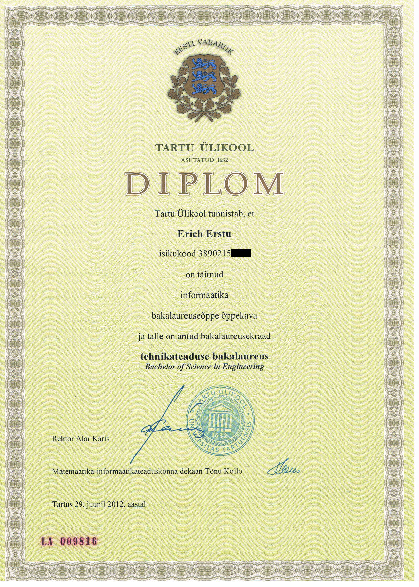

|                                                                              |
| :--------------------------------------------------------------------------: |
|                                                                              |
|                                      |
|                                                                              |
|                                  Erich Erstu                                 |
|                                                                              |
|      _"In which lies the true question, that is the ultimate question."_     |
|                                                                              |
|            software engineer, game developer, researcher, investor           |

# About ########################################################################

This website serves as a formal publication of both the professional and social
information about the living soul known as Erich Erstu.

## Biography ###################################################################

In his professional life Erich Erstu is a software engineer and a computer game
developer who often challenges the mundane world of dogmas with his novel
approaches and unconventional thinking. Although he has spent a fair share of
his working hours devising BitCoin and online gambling related projects his
favourite software engineering challenge is the creation of a horizontally
scalable game server for a massively multiplayer online role playing game.

He wrote his first computer program at the age of five in QBasic. At the age of
12 he developed his first video game using the _GameMaker_ software. He learned
the C language on his own while modding a multi user dungeon (MUD) server. At
the age of 16 he started learning C++ which quickly became his favourite
programming language. Although he used the Windows operating system up until the
year 2012 he switched to Linux due to security concerns when buying his first
BitCoin.

Over the course of his life Erich has created dozens of video games and a
multitude of software projects, albeit none of these endevours has brought him
any long-lasting fame or fortune. His ability to see the future and to make good
speculative investments on the other hand has abundantly compensated him the
time he has spent on developing software. That said, he does not see any of his
discontinued projects as a failure. If there were not for all those projects, he
would not be able to claim today that he is a seasoned software developer.

In his private life Erich enjoys lifting weights in the gym as a hobbyist
bodybuilder and often times innovation strikes him exactly there when he is
taking a resting break between sets. When at home he spends much of his computer
time on research of various (mostly controversial) topics. He is convinced that
in order to gain a competitive advantage in front of his fellow man he must
discard the mainstream beliefs and hold a mindset that the majority of "well
educated" people are wrong about virtually everything.

## Academic Degrees ############################################################

  * Master of Science in Software Engineering, University of Tartu, 2014

    

  * Bachelor of Science in Engineering, University of Tartu, 2012

    

## Professional Certifications #################################################

  * Web Application Security Advanced

    
